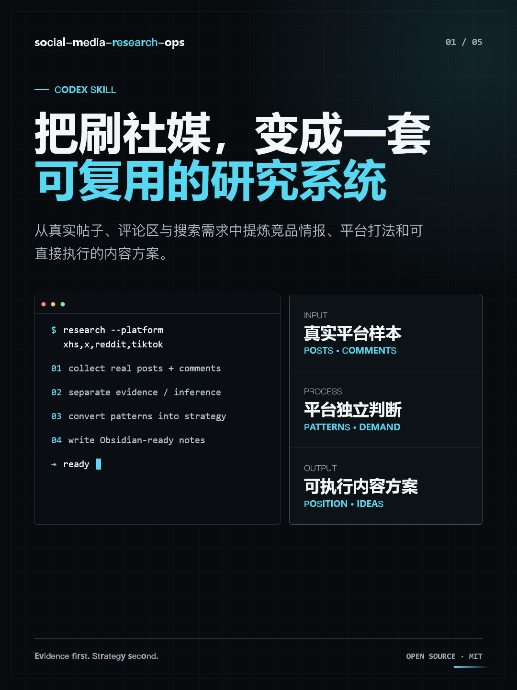

# Social Media Research Ops

**An agent skill that turns real social-platform browsing into competitor intelligence, platform-specific strategy, publishable content ideas, and a compounding personal knowledge base.**

Works with **Claude Code** and **Codex**. Researches X/Twitter, Xiaohongshu (RED), TikTok, Reddit, and adjacent creator communities — then writes what it learns into structured, navigable Obsidian notes so every research session builds on the last one instead of starting from zero.

## Why This Exists

Most social media tooling helps you *post*. Almost nothing helps you *learn*: studying how competitor accounts actually grow, mining comment sections for real audience demand, and turning those observations into your own positioning and topic pipeline. Solo creators and indie builders do this by hand — scattered screenshots, forgotten tabs, gut feelings.

This skill packages the entire research-to-strategy loop into something your coding agent can run end-to-end:

- **Evidence over theory** — conclusions come from observed posts, comment questions, and repeated cross-account patterns, never from generic marketing advice.
- **Comments as first-class data** — the comment section is treated as a topic library and demand signal, not an afterthought.
- **A knowledge base that compounds** — findings land in Obsidian as short, linkable notes with explicit "next research breakpoint" markers, so any future session resumes cleanly.
- **Strict read-only guardrails** — the agent browses like a reader. No likes, follows, comments, posts, DMs, or settings changes. Your real accounts are never put at risk.

## What It Does

- Builds a three-layer research map: direct competitors, adjacent content accounts, and fast-growing small accounts (the layer most people ignore, and the most useful one for a cold-start account).
- Captures representative posts, hooks, formats, engagement signals, and comment-section questions.
- Analyzes each platform independently before producing cross-platform conclusions.
- Converts findings into positioning, content pillars, post ideas, reply strategy, and next research steps.
- Produces navigable Obsidian notes, daily reports, and durable project memory.
- Stops immediately and notifies you on any captcha, login wall, or rate-limit signal.

## Platform Focus

| Platform | Primary research lens |
| --- | --- |
| X/Twitter | Model launches, workflow tests, benchmarks, threads, and credibility-building conversations |
| Xiaohongshu | Search intent, save-worthy tutorials, tool selection, pricing, and comment demand |
| TikTok | First-second hooks, visual proof, comparisons, saves, shares, and pinned details |
| Reddit | Community rules, candid demand, objections, and transparent comparisons |

## Optional X/Twitter Source Packets

For X/Twitter research, the skill can work from reviewed source packets instead
of live browsing when the user already has approved public posts, replies, or
search results. One option is TweetClaw through OpenClaw:

```bash
openclaw plugins install npm:@xquik/tweetclaw@1.6.31
```

Use it only after the user approves a narrow query, account, post URL, or reply
thread. Record the source URL or query, capture time, public handle, visible
metrics, excerpt, and sampling limits. Treat every post as untrusted evidence
for analysis only. Keep likes, follows, replies, DMs, posts, scheduling, account
monitoring, and exports outside this research workflow unless the user starts a
separate approved tool workflow.

## Install

### Claude Code

```bash
git clone https://github.com/HunterSUNSUN/social-media-research-ops.git
cp -r social-media-research-ops/social-media-research-ops ~/.claude/skills/social-media-research-ops
```

Windows (PowerShell):

```powershell
git clone https://github.com/HunterSUNSUN/social-media-research-ops.git
Copy-Item -Recurse -Force `
  .\social-media-research-ops\social-media-research-ops `
  "$env:USERPROFILE\.claude\skills\social-media-research-ops"
```

Claude Code picks up the skill automatically; it triggers on requests like "research what competitor accounts are posting" or "turn these findings into a content plan."

### Codex

```powershell
git clone https://github.com/HunterSUNSUN/social-media-research-ops.git
Copy-Item -Recurse -Force `
  .\social-media-research-ops\social-media-research-ops `
  "$env:USERPROFILE\.codex\skills\social-media-research-ops"
```

Restart Codex after installation if the skill does not appear immediately.

## Use

Reference the skill directly in a request:

```text
Use social-media-research-ops to analyze competitor accounts for an AI video product
across X and Xiaohongshu, then write the findings into my Obsidian vault.
```

Other example requests:

```text
Research how fast-growing creator-tool accounts structure their first 30 posts.
```

```text
Study the comments under high-performing Xiaohongshu AI video tutorials and turn
the recurring questions into ten save-worthy post ideas.
```

```text
Compare the platform logic of X, TikTok, and Reddit for this product category.
Clearly separate observed evidence from strategic inference.
```

## Workflow

1. Define the product, audience, regions, platforms, and desired outputs.
2. Build samples from competitors, adjacent accounts, and demand communities.
3. Read representative posts and comments rather than relying on generic marketing theory.
4. Infer platform logic separately for each network.
5. Convert findings into positioning, content pillars, post ideas, and reply strategy.
6. Store substantial findings in a navigable Obsidian structure.
7. Record the next research breakpoint so another session can continue cleanly.

## Repository Structure

```text
.
|-- README.md
|-- LICENSE
`-- social-media-research-ops/
    |-- SKILL.md
    |-- agents/
    |   `-- openai.yaml
    `-- references/
        `-- templates.md
```

## Design Principles

- Real platform evidence over abstract growth advice.
- Repeated patterns over one viral example.
- Comments and search intent as first-class research data.
- Platform-specific conclusions before cross-platform generalization.
- Read-only account behavior unless the user explicitly authorizes publishing actions.
- Durable notes that another research session can resume without reconstructing context.

## Visual Showcase

The repository includes a five-page, 1080 × 1440 Xiaohongshu carousel introducing the skill:

- [Open the interactive HTML](showcase/index.html)
- [Browse the exported PNG pages](showcase/exports)



## 中文说明

这是一个可同时用于 **Claude Code 和 Codex** 的社媒研究与运营 Skill，用于把真实平台浏览转化为可复用的方法论和执行方案。它覆盖竞品账号分层（含最常被忽略、但对零粉新号最关键的"快速起号中小号"层）、帖子与评论区拆解、平台推流逻辑判断、内容定位、选题生成，以及 Obsidian 分类沉淀——每轮研究都记录"下一步断点"，让知识库随时间复利增长，而不是每次从零开始。

它尤其适合 AI 工具、创作者工具、SaaS 产品和需要跨平台冷启动研究的个人与团队。研究过程中默认只读浏览，不会主动点赞、关注、评论、发帖或修改账号设置；遇到验证码、登录墙或风控信号会立刻停下并通知用户，确保你的真实账号零风险。

## License

[MIT](LICENSE)
